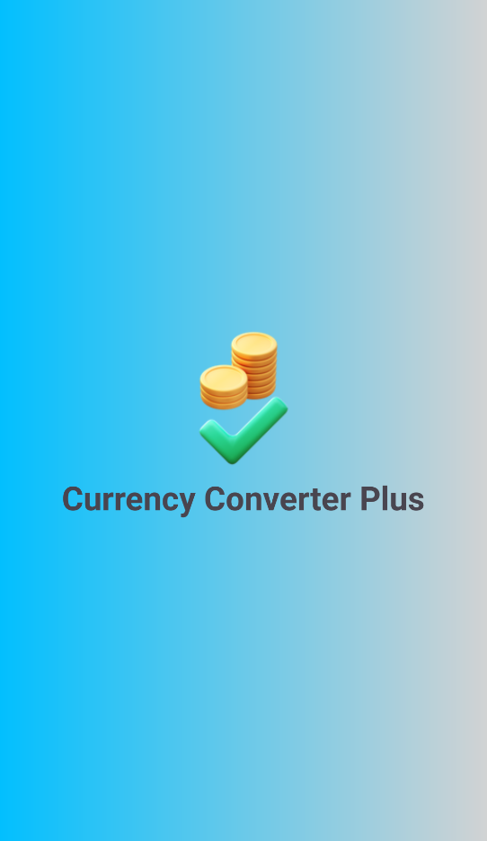

# Currency Convert Plus Application

## Introduction

This currency converter app offers a comprehensive suite of features, including currency conversion, news reading, and real-time exchange rate updates. Leveraging Android's ViewModel and Navigation components, as well as Retrofit for API interactions, the app provides a seamless and enjoyable user experience.

## Features

- Structure: MVVM
- Home Screen : Convert currency by selecting currency in bottomsheetfragment
- News Screen : Read News Online
- Chart Screen : Visualize selected currency

## Demo

- Link: [Demo](https://www.youtube.com/watch?v=ODIddqSgR50/)

## Challenges

- Structure API format is very hard to handle
- API_KEY expired
- Handling Error

## Screenshots

<h3>Splash Screen</h3>
  

<h3>OnBroading Screen</h3>
  

<h3>Home Screen</h3>
  

<h3>News Screen</h3>
  

<h3>Chart Screen</h3>
  

## Prerequisites:

- Android Studio: You need to have Android Studio installed on your system.
- Git: A Git client should be installed on your system. If not, you can download it from the official Git website.
- GitHub Account: You need to have a GitHub account.

## Setup

- Using Android Studio and clone project in this repository
- In Android Studio, click the "Run" button or press the shortcut key (usually Shift+F10).
- Android Studio will build the project and run it on an emulator or connected device.

## Tech Stack

**Programming Language:** Kotlin

**Databases:**Room

## Reference

| Tool                 | Link                                                                               |
| -------------------- | ---------------------------------------------------------------------------------- |
| Navigation Component | [Navigation Component](https://developer.android.com/guide/navigation)             |
| View Model           | [View Model](https://developer.android.com/topic/libraries/architecture/viewmodel) |
| Glide                | [Glide](https://github.com/bumptech/glide)                                         |
| Circle Indicator     | [Circile Indicator](https://github.com/ongakuer/CircleIndicator)                   |
| Room Database        | [Room Database](https://developer.android.com/training/data-storage/room)          |
| Retrofit             | [Retrofit](https://square.github.io/retrofit/)                                     |
| API Currency         | [API Currency](https://exchangeratesapi.io/)                                       |
| API News             | [API News](https://newsapi.org/)                                                   |
| AndroidSVG           | [Android SVG](https://bigbadaboom.github.io/androidsvg/)                           |
| Chart                | [Chart](https://github.com/PhilJay/MPAndroidChart/)                                |
| Kotlin-Reflect       | [Kotlin-Reflect](https://kotlinlang.org/docs/reflection.html/)                     |

## Requirements

- SDK 34
- Retrofit
